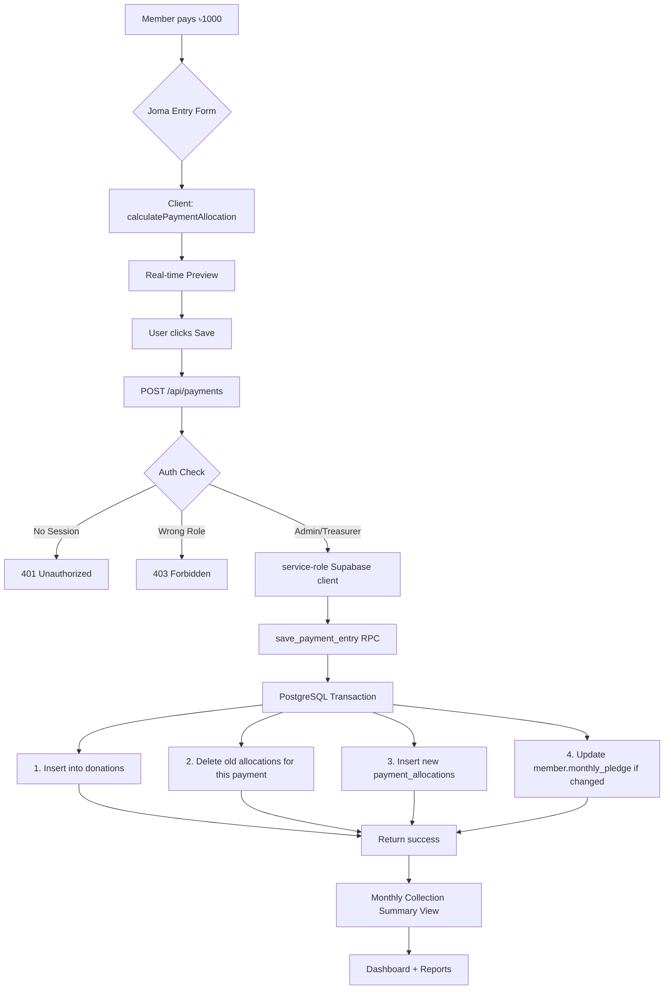
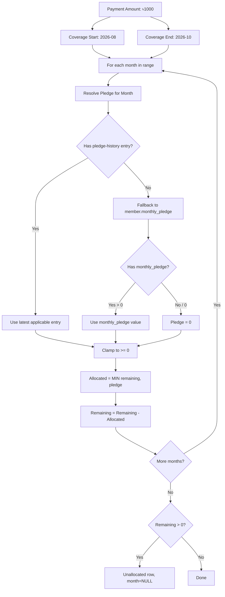
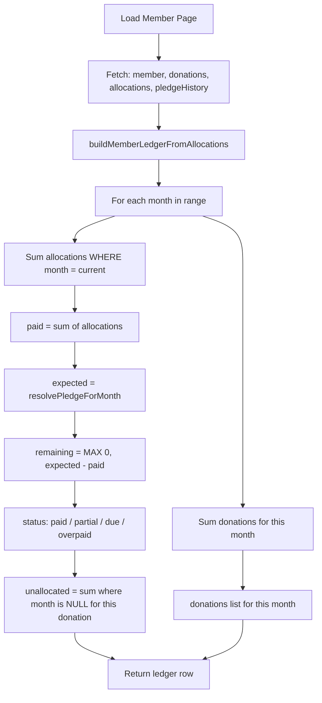
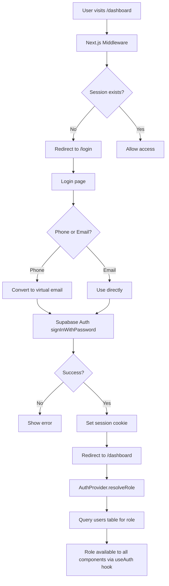
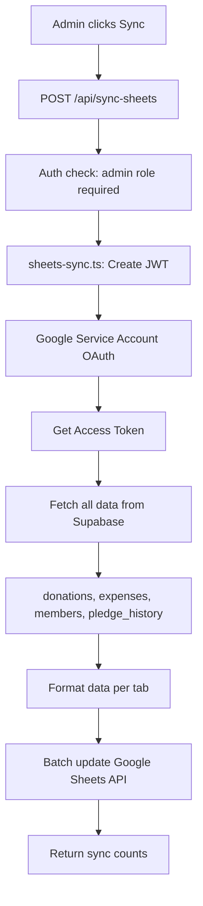
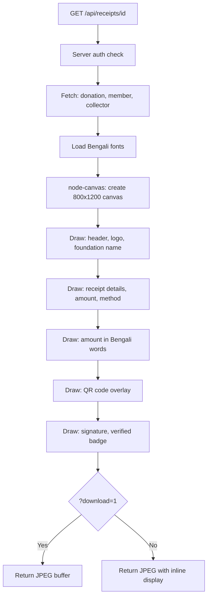
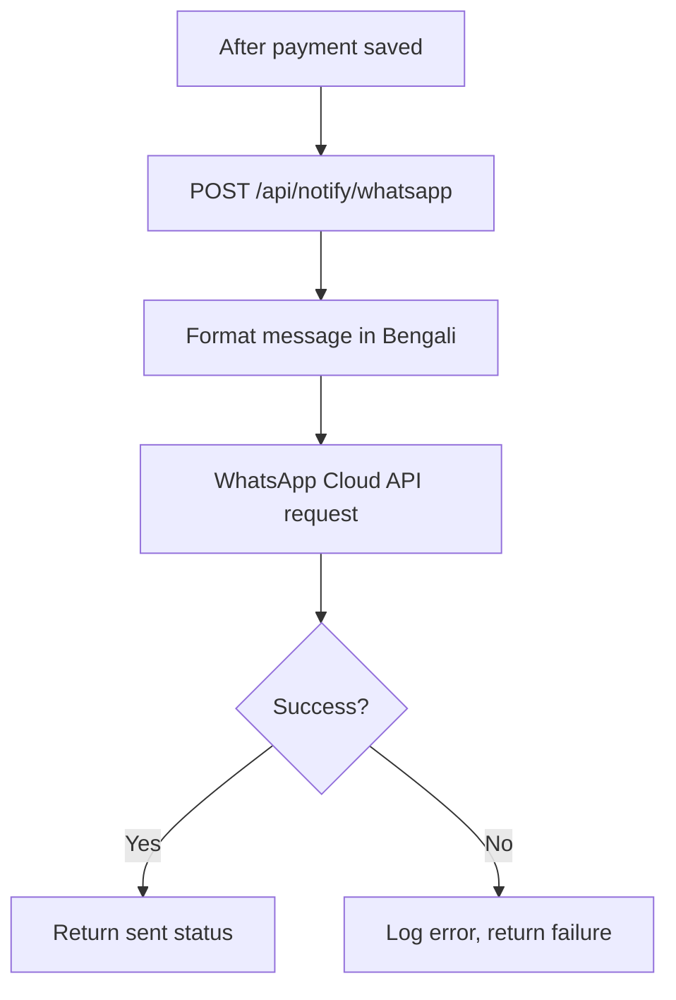

# Data Flow Diagrams

## Payment Allocation Flow

The most critical data flow in the system. Every taka must be accounted for.

## Allocation Algorithm (Canonical)

## Ledger Build Flow (Reports / Member Detail)

## Auth Flow

## Google Sheets Sync Flow

## Receipt Generation Flow

## WhatsApp Notification Flow

